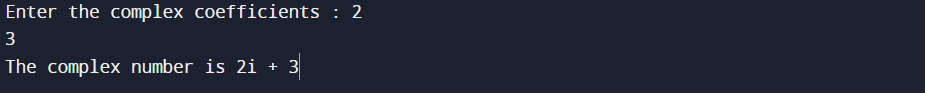
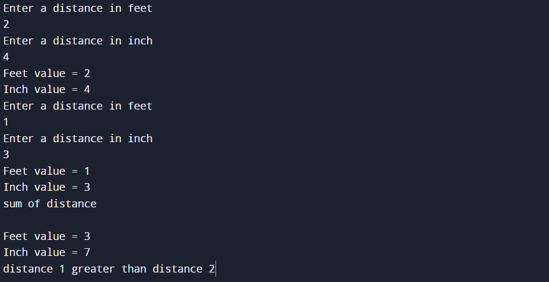
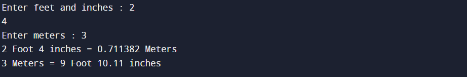
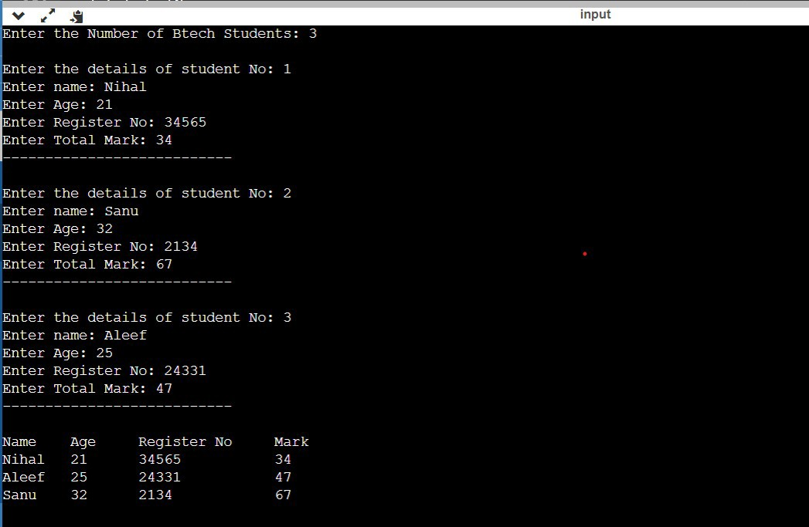

## Question 10
❔ 

### Program

```cpp
#include <iostream>

class Complex{
private:
    float a, b;

public:
    Complex() = default;

    friend std::ostream &operator<<(std::ostream &out, Complex &p) {
        return out << p.a << "i + " << p.b;
    }

    friend std::istream &operator>>(std::istream &is, Complex &p) {
        return is >> p.a >> p.b;
    }
};

int main()
{
    Complex c{};

    std::cout << "Enter the complex coefficients : ";
    std::cin >> c;

    std::cout << "The complex number is "<< c;

    return 0;
}
```

### Algorithm

```markdown

```

### Output

```text
Enter the complex coefficients : 3
6
The complex number is 3i + 6
```



## Question 11
❔ 

### Program

```cpp
#include <cmath>
#include <iostream>

class PolarCoordinates {
private:
    double theta, r;

public:

    PolarCoordinates(double r, double theta) {
        this->theta = theta;
        this->r = r;
    }

    PolarCoordinates() = default;

    double getX() const {
        return r * cos(theta);
    }

    double getY() const{
        return  r * sin(theta);
    }

    friend std::ostream &operator<<(std::ostream &out, PolarCoordinates &p) {
        return out << "r = " << p.r << " theta = " << p.theta;
    }

    friend std::istream &operator>>(std::istream &is, PolarCoordinates &p) {
        return is >> p.r >> p.theta;
    }

};

class RectangularCoordinates {
private:
    double x, y;

public:

    RectangularCoordinates(double x, double y) {
        this->x = x;
        this->y = y;
    }

    RectangularCoordinates() = default;

    double getR() const
    {
        return sqrt(x*x + y*y);
    }

    double getTheta() const
    {
        return atan(y/x);
    }

    explicit operator PolarCoordinates() const {
        return {getR(), getTheta()};
    }

    RectangularCoordinates &operator=(PolarCoordinates &p) {
        this->x = p.getX();
        this->y = p.getY();

        return *this;
    }

    friend std::ostream &operator<<(std::ostream &out, RectangularCoordinates &p) {
        return out << "( " << p.x << " , " << p.y << " )";
    }

    friend std::istream &operator>>(std::istream &is, RectangularCoordinates &p) {
        return is >> p.x >> p.y;
    }
};


int main()
{
    PolarCoordinates p{};
    RectangularCoordinates r{};

    std::cout << "Enter radius and angle : ";
    std::cin >> p;

    std::cout << "Enter x and y coordinates : ";
    std::cin >> r;

    PolarCoordinates pFromR = (PolarCoordinates) r;
    RectangularCoordinates rFromP{};
    rFromP = p;

    std::cout << p << " in rectangular coordinates = " << rFromP << std::endl;
    std::cout << r << " in polar coordinates = " << pFromR << std::endl;

    return 0;
}
```

### Algorithm

```markdown
```

### Output

```text
Enter radius and angle : 2
30
Enter x and y coordinates : 2
4
r = 2 theta = 30 in rectangular coordinates = ( 0.308503 , -1.97606 )
( 2 , 4 ) in polar coordinates = r = 4.47214 theta = 1.10715
```



## Question 12
❔ 

### Program

```cpp
#include <iostream>

using namespace std;

class Distance {
    int feet, inch;

public:
    Distance() {
        feet = 0;
        inch = 0;
    }

    void get_value() {
        cout << "Enter a distance in feet \n";
        cin >> feet;
        cout << "Enter a distance in inch \n";
        cin >> inch;
    }

    void display_data() const {
        cout << endl << "Feet value = " << feet << endl;
        cout << "Inch value = " << inch << endl;
    }

    Distance operator+(Distance &obj) const {
        Distance demo;

        demo.feet = feet + obj.feet;
        demo.inch = inch + obj.inch;

        if (demo.inch >= 12) {
            demo.feet += (demo.inch / 12);
            demo.inch = demo.inch % 12;
        }

        return demo;
    }

    friend string operator<(Distance &, Distance &);
};

string operator<(Distance &obj1, Distance &obj2) {
    if (obj1.feet < obj2.feet) {
        return "distance 1 less than distance 2\n";
    } else if (obj1.feet == obj2.feet && obj1.inch < obj2.inch) {
        return "distance 1 less than distance 2\n";
    } else if (obj1.feet > obj2.feet) {
        return "distance 1 greater than distance 2\n";
    } else if (obj1.feet == obj2.feet && obj1.inch > obj2.inch) {
        return "distance 1 great than distance 2\n";
    } else {
        return "distance 1 equal to distance 2\n";
    }
}

int main() {
    Distance obj1, obj2;

    obj1.get_value();
    obj1.display_data();

    obj2.get_value();
    obj2.display_data();

    Distance obj3 = obj1 + obj2;
    cout << "sum of distance\n";
    obj3.display_data();

    string out = obj1 < obj2;
    cout << out;
    return 0;
}
```

### Algorithm

```markdown
```

### Output

```text
Enter a distance in feet 
2
Enter a distance in inch 
4
Feet value = 2
Inch value = 4
Enter a distance in feet 
1
Enter a distance in inch 
3
Feet value = 1
Inch value = 3
sum of distance

Feet value = 3
Inch value = 7
distance 1 greater than distance 2
```


## Question 13
❔ 

### Program

```cpp
#include <cmath>
#include <iostream>

class FeetInch {
private:
    double inch;
    int feet;

    void validate()
    {
        int extra = (int) (this->inch / 12);
        this->feet += extra;
        this->inch -= extra * 12;
    }

public:

    FeetInch(int r, double theta) {
        this->inch = theta;
        this->feet = r;

        validate();
    }

    FeetInch() = default;

    double getMeters() const {
        return (feet + inch/12) / 3.28;
    }

    friend std::ostream &operator<<(std::ostream &out, FeetInch &p) {
        return out << p.feet << " Foot " << p.inch << " inches";
    }

    friend std::istream &operator>>(std::istream &is, FeetInch &p) {
        is >> p.feet >> p.inch;
        p.validate();

        return is;
    }

};

class Meter {
private:
    double length;

public:

    explicit Meter(double x) {
        this->length = x;
    }

    Meter() = default;

    int getFeet() const
    {
        return (int) (this->length * 3.28);
    }

    double getInch() const
    {
        return (this->length * 39.37) - (getFeet() * 12);
    }

    explicit operator FeetInch() const {
        return {getFeet(), getInch()};
    }

    Meter &operator=(FeetInch &p) {
        this->length = p.getMeters();
        return *this;
    }

    friend std::ostream &operator<<(std::ostream &out, Meter &p) {
        return out <<  p.length << " Meters";
    }

    friend std::istream &operator>>(std::istream &is, Meter &p) {
        return is >> p.length;
    }
};


int main()
{
    FeetInch p{};
    Meter r{};

    std::cout << "Enter feet and inches : ";
    std::cin >> p;

    std::cout << "Enter meters : ";
    std::cin >> r;

    FeetInch pFromR = (FeetInch) r;
    Meter rFromP{};
    rFromP = p;

    std::cout << p << " = " << rFromP << std::endl;
    std::cout << r << " = " << pFromR << std::endl;

    return 0;
}
```

### Algorithm

```markdown
```

### Output

```text
Enter feet and inches : 2
4
Enter meters : 3
2 Foot 4 inches = 0.711382 Meters
3 Meters = 9 Foot 10.11 inches
```



## Question 14
❔ 

### Program

```cpp
#include <iostream>
using namespace std;
class Student{
protected:
string name;
int age, reg_no;
public:
virtual void sort(int studentNo) = 0;
};
class BTechStudent : public Student{
float marks;
public:
void input(){
cout<<"Enter name: ";
cin>>name;
cout<<"Enter Age: ";
cin>>age;
cout<<"Enter Register No: ";
cin>>reg_no;
cout<<"Enter Total Mark: ";
cin>>marks;
cout<<"
";
}
void sort(int studentNo);
};
static BTechStudent bstudent[10];
void BTechStudent :: sort(int studentNo){
for(int i = 0;i<studentNo;i++){
BTechStudent temp;
for(int j = i+1;j<studentNo;j++){
if(bstudent[i].marks > bstudent[j].marks){
temp = bstudent[i];
bstudent[i] = bstudent[j];
bstudent[j] = temp;
}
if(bstudent[i].marks == bstudent[j].marks){
if(bstudent[i].name > bstudent[j].name){
temp = bstudent[i];
bstudent[i] = bstudent[j];
bstudent[j] = temp;
}}
}
}
cout<<"\nName\tAge\tRegister No\tMark\n";
for(int i = 0;i<studentNo;i++){
cout<<bstudent[i].name<<"\t"<<bstudent[i].age<<"\t"<<bstudent[i].reg_no<<"\t\t"<<bstudent[i].
marks<<"\n";
}
}
class MTechStudent : public Student{
float gpa;
public:
void input(){
cout<<"Enter name: ";
cin>>name;
cout<<"Enter Age: ";
cin>>age;
cout<<"Enter Register No: ";
cin>>reg_no;
cout<<"Enter Last CGPA: ";
cin>>gpa;
cout<<"
";
}
void sort(int studentNo);
};
MTechStudent mstudent[5];
void MTechStudent :: sort(int studentNo){
for(int i = 0;i<studentNo;i++){
MTechStudent temp;
for(int j = i+1;j<studentNo;j++){
if(mstudent[i].gpa > mstudent[j].gpa){
temp = mstudent[i];
mstudent[i] = mstudent[j];
mstudent[j] = temp;
}
if(mstudent[i].gpa == mstudent[j].gpa){
if(mstudent[i].name > mstudent[j].name){
temp = mstudent[i];
mstudent[i] = mstudent[j];
mstudent[j] = temp;
}
}}
}
cout<<"\nName\tAge\tRegister No\tGPA\n";
for(int i = 0;i<studentNo;i++){
cout<<mstudent[i].name<<"\t"<<mstudent[i].age<<"\t"<<mstudent[i].reg_no<<"\t\t"<<mstudent[i
].gpa<<"\n";
}
}
int main(){
int bstudentNo;
cout<<"Enter the Number of Btech Students: ";
cin>>bstudentNo;
for(int i = 0;i<bstudentNo;i++){
cout<<"\nEnter the details of student No: "<<i+1<<"\n";
bstudent[i].input();
cout<<"\n";
}
Student* student = new BTechStudent();
student->sort(bstudentNo);
int mstudentNo;
cout<<"\n\nEnter the Number of Mtech Students: ";
cin>>mstudentNo;
for(int i = 0;i<mstudentNo;i++){
cout<<"Enter the details of student No: "<<i+1<<"\n";
mstudent[i].input();
cout<<"\n";
}
student = new MTechStudent();
student->sort(mstudentNo);
}

```

### Algorithm

```markdown
1. Start
2. Create a base class student
3. Declare a string variable to store name, 2 int variables for storing age and register No as
protected and declare a pure virtual function sort Which accepts an int as argument
4. Create a class BTechStudent which inherits class Student
5. Declare a float variable to store marks and a function input () for inputting the student details
from the user.
6. Declare a function sort inside the class and defined outside the class
7. Declare an array of objects of this class just below this class.
8. Inside sort function Use bubble sort to sort the above-mentioned array.
9. If the marks are unequal bring the higher scored student to initial indices
10. If the marks are equal sort the students according to the alphabetic order Of their name.
11. Display the sorted array with proper titles
12. Create a class MTech Student which inherits class Student
13. Declare a float variable to store cgpa and a function input () for inputting the student details
from the user.
14. Repeat the same process from 4 to 11 for this class also
15. Inside the main function declare two int variables and ask the user how many btech students he
wants to enter and store it
16. Run a for loop until the user's choice and store the details to the Object array of theclass
btechstudent
17. Create a pointer of class Student and store instance of class Btech student and call function sort
using the pointer
18. Ask the user how many Mtech students he wants to enter and store it.
19. Run a for loop until users choice and store the student details to the arrayof objects of this
class using input fn.
20. Assign the new instance of class MTech student to the above created Pointer and call function
sort
21. Stop
```

### Output

```text


```



## Question 15
❔ 

### Program

```cpp

```

### Algorithm

```markdown

```

### Output

```text

```


